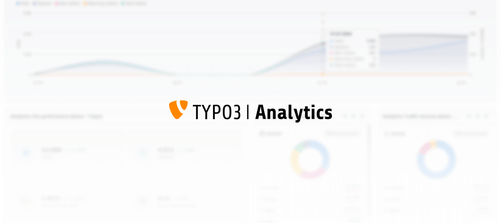

..  include:: /Includes.rst.txt

..  _introduction:

============
Introduction
============

TYPO3 Analytics is a web analytics service built for TYPO3. Editors and
administrators can view analytics data directly in the TYPO3 backend without
having to switch to a separate tool.

..  note::
    After a free trial period you will need a paid subscription to continue
    using this extension. You can find plans and pricing in the backend module
    after you have installed the extension or at
    `analytics.typo3.com <https://analytics.typo3.com>`__.

What the extension provides
===========================

The extension adds a :guilabel:`Sites > TYPO3 Analytics` module to the TYPO3 backend.
It provides:

**Registration**
    Enter an email address to register a site in your installation with the TYPO3 Analytics API.
    The API injects a tracking code into every frontend page.

**Status display**
    Shows the registration status, website ID and API key.
    The status is cached but can be refreshed manually.

**Dashboard**
    Opens the **TYPO3 Analytics web dashboard** as an embedded iframe inside the
    TYPO3 backend. Note that the **TYPO3 Analytics web dashboard** and a
    **TYPO3 dashboard** are two different things.

**Dashboard widgets**
    Four widgets for a **TYPO3 dashboard** — Traffic Graph, Site
    Performance, Top Pages, and Traffic Sources. Editors
    can view all analytics data at-a-glance on a TYPO3 dashboard .

**Page Performance Bar**
    An analytics bar above a page in the backend :guilabel:`Content > Layout`
    module (:guilabel:`Web > Page` in TYPO3 v13). It displays page metrics such as page views, bounce
    rate, and average visitor duration.

Requirements
============

..  list-table::
    :header-rows: 1
    :widths: 30 70

    *   -   Component
        -   Version
    *   -   PHP
        -   ^8.2
    *   -   TYPO3
        -   ^13.4 or ^14.0
    *   -   libsodium
        -   PHP extension (bundled since PHP 7.2)
